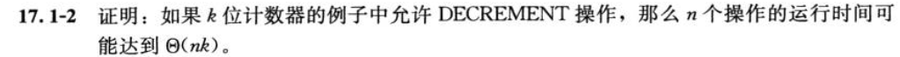

# chapter 17 amortized analysis

## 17.1 aggregate analysis

### 17.1-1

1. **MULTIPUSH操作分析**：最坏情况的时间复杂度为O(n)；
2. **总时间复杂度**：最坏情况，时间复杂度可以达到O(n^2)，那么摊还代价的界是O(n)。

### 17.1-2

1. **DECREMENT 操作分析**：最坏情况下，需要对每一位进行借位，如果最低位为0那么需要从高位借位，可能导致连续的多次借位，因此最坏情况下的DECREMENT操作的时间复杂度为O(k)；
2. **总时间复杂度**：最坏情况下，进行n次DECREMENT操作，因此总时间复杂度为O(nk)；

### 17.1-3

1.**编号为2的幂的操作**：其代价分别为1，2，4，8，……，2^k，这些操作的总代价为2^(k+1)-1，其中k=log2(n)，因此总代价为O(n)；
2.**其他操作**：其他操作的代价为1，总共有n-k个操作，因此总代价为O(n-k)；
3. **总时间复杂度**：最坏情况下，总时间复杂度为O(n)，平均每个操作的代价为O(1)。
