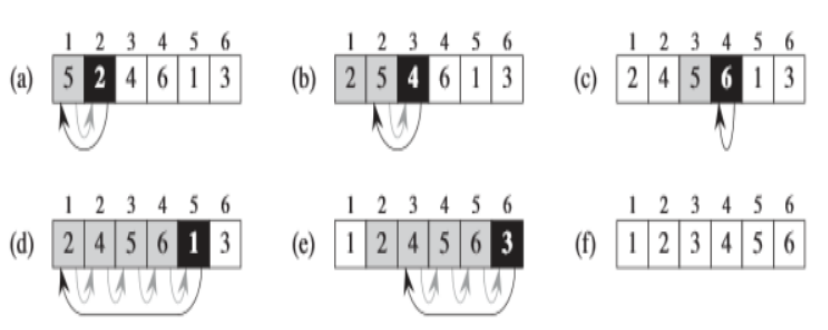

# Basic Concepts

## 为什么要学习算法？

学习算法不仅是计算机科学的核心内容，也是解决实际问题的关键工具。算法帮助我们理解问题的可扩展性，提升程序性能，并为复杂问题提供系统化的解决方案。以下内容将深入探讨学习算法的重要性，并通过一系列问题展示算法在不同场景中的应用。

### 学习目标

1. **理解算法的时间和空间复杂度**：使用大 \(O\)（O）、大 \(\Omega\)（Ω）和大 \(\Theta\)（Θ）符号描述算法的渐近上界、下界和紧确界。
2. **分析简单算法的时间复杂度**：确定简单算法的时间复杂度，推导递归算法的递推关系，并解决简单的递推关系。
3. **设计多种算法**：运用暴力法、贪心算法、动态规划、分治法、分支限界法等策略设计算法。
4. **应用抽象数据类型**：使用并实现哈希表、二叉搜索树和图等基本抽象数据类型，以高效解决算法问题。
5. **运用基本搜索和排序技术**：掌握顺序搜索、二分搜索、\(O(N \log N)\) 排序算法，以及基本的图算法，包括深度优先搜索（DFS）、广度优先搜索（BFS）、单源最短路径、全源最短路径和最小生成树算法。
6. **培养算法评估与选择能力**：能够评估算法，选择合适的解决方案，并在简单的编程环境中实现算法。

### 算法在计算机科学中的重要性

除了性能，以下因素在计算机相关问题中同样重要：

1. **正确性**：算法必须准确解决问题，避免错误。
2. **功能性**：算法应满足所有需求和功能规范。
3. **可靠性**：算法在不同情况下都能稳定运行。
4. **模块化**：算法设计应具备良好的模块化结构，便于维护和扩展。
5. **可维护性**：代码应易于理解和修改。
6. **鲁棒性**：算法应能应对异常情况和输入。
7. **用户友好性**：算法应考虑用户体验，提供友好的接口。
8. **程序员时间**：开发和维护算法所需的时间应尽量减少。
9. **简洁性**：算法应尽量简洁，避免不必要的复杂性。
10. **可扩展性**：算法设计应便于扩展以适应更大的问题规模或变化的需求。

### 经典算法问题

以下是一些经典的算法问题，每个问题都旨在培养不同的算法设计和分析能力。对于每个问题，将提供简要的描述和思考方向，以帮助我们更好地理解和解决这些问题。

#### 问题 1：摔鸡蛋

**描述**：你有 2 个相同的鸡蛋，并可以使用它们在一栋 100 层的建筑中进行实验。鸡蛋从某一层楼摔下可能会破碎，也可能不会。你的任务是确定鸡蛋不会破碎的最高楼层。你最多可以摔破 2 个鸡蛋。需要最少的实验次数是多少？

**思考方向**：使用分层测试的方法，平衡每次测试后的范围，减少最坏情况下的测试次数。可以考虑使用数学上的等差数列来优化。

#### 问题 2：复杂的多项式谜题

**描述**：假设你有一个黑盒，里面有一个秘密的多项式 \(p(x)\)。你可以输入任意实数 \(x\)，黑盒会返回 \(p(x)\) 的值。已知多项式的所有系数都是自然数。你的任务是找出多项式的确切系数。

**思考方向**：通过多次输入不同的 \(x\) 值，构建方程组求解多项式系数。考虑使用插值法或其他多项式求解技术。

#### 问题 3：寻找最优候选人

**描述**：有 \(n\) 个候选人按随机顺序依次到达面试。你只能确定候选人到达时的相对排名，无法知道绝对排名。每次面试后，必须立即决定接受或拒绝该候选人，一旦拒绝无法召回，接受后停止面试。任务是设计策略以最大化找到最优候选人的概率。

**思考方向**：经典的“秘书问题”，可以使用最佳停止理论，确定一个最佳的拒绝前一部分候选人的比例，然后选择后续第一个比之前所有候选人更优秀的。

#### 问题 4：分糖果

**描述**：有 \(n\) 个孩子站成一排，每个孩子有一个评分值。你需要给这些孩子分发糖果，满足以下要求：

- 每个孩子至少有一颗糖果。
- 评分更高的孩子比相邻的孩子获得更多的糖果。

**返回**：分发糖果的最小总数。

**思考方向**：使用两次遍历的方法，分别从左到右和从右到左更新糖果分配，确保满足所有条件。

#### 问题 5：建造围栏

**描述**：给定一个包含多棵树位置的数组，代表花园中树的位置。要求用最少长度的绳子围住所有树，返回位于围栏周边的树的位置坐标。

**思考方向**：计算凸包问题，可以使用 Graham 扫描或 Andrew's 算法来找到最外层的树。

#### 问题 6：寻找最大子矩阵

**描述**：给定一个 \(N \times N\) 的矩阵，包含正整数和负整数。编写代码找到元素和最大的子矩阵。

**思考方向**：扩展一维的最大子数组和（Kadane 算法）到二维，利用动态规划优化求解。

#### 问题 7：合并公司

**描述**：给定 \(N\) 个公司，目标是将它们合并成一个大公司。每次只能合并两个公司成一个新公司。问有多少种不同的合并方式。

**思考方向**：这是一个组合数学问题，涉及二叉树的计数，可以使用卡塔兰数来计算。

#### 问题 8：在大列表中查找小列表

**描述**：给定一个小的有序数字列表和一个非常长的有序数字列表（存储在不同的磁盘块中），如何在大列表中查找小列表中的数字？

**思考方向**：使用二分搜索或多路归并搜索，考虑磁盘访问的优化，减少 I/O 操作。

#### 问题 9：寻找最小距离三元组

**描述**：给定三个已排序的数组，找到一个三元组（每个数组中一个元素），使得这三个元素的最大距离最小。距离定义为三个元素之间的最大差值。

**思考方向**：使用三个指针同时遍历三个数组，逐步缩小可能的最小距离。

#### 问题 10：在排序数组中查找特定元素的索引

**描述**：给定一个已排序的数组，返回特定整数第一次出现的索引。要求时间复杂度为次线性时间，不能逐个元素搜索。

**思考方向**：使用二分搜索，找到目标值的起始位置。

### 算法复杂度分析

在评估和设计算法时，理解算法的时间和空间复杂度至关重要。以下是基本的复杂度符号：

- **大 \(O\) 符号**：描述算法的渐近上界，表示最坏情况下的性能。
- **大 \(\Omega\) 符号**：描述算法的渐近下界，表示最好情况下的性能。
- **大 \(\Theta\) 符号**：描述算法的渐近紧确界，表示平均情况下的性能。

#### 示例分析

以“二分搜索”为例：

- **时间复杂度**：每次操作将搜索范围减半，因此时间复杂度为 \(O(\log n)\)。
- **空间复杂度**：如果使用迭代实现，空间复杂度为 \(O(1)\)；递归实现则为 \(O(\log n)\)（调用栈的深度）。

### 算法设计策略

不同的问题需要不同的算法设计策略，以下是几种常见的策略：

1. **暴力法**：尝试所有可能的解决方案，适用于规模较小的问题。
2. **贪心算法**：每一步选择当前最优解，适用于具有贪心选择性质的问题。
3. **动态规划**：将问题分解为子问题，存储子问题的结果以避免重复计算，适用于具有最优子结构和重叠子问题的问题。
4. **分治法**：将问题分解为独立的子问题，递归解决子问题，然后合并结果。
5. **分支限界法**：系统地遍历所有可能的解决方案，同时利用约束条件剪枝以减少搜索空间。

### 抽象数据类型的应用

掌握和应用基本的抽象数据类型（如哈希表、二叉搜索树和图）能够显著提高算法的效率和可实现性。例如：

- **哈希表**：用于快速查找、插入和删除操作，时间复杂度平均为 \(O(1)\)。
- **二叉搜索树**：支持有序的数据存储，允许快速查找、插入和删除，时间复杂度平均为 \(O(\log n)\)。
- **图**：用于表示网络结构，支持多种图算法，如 DFS、BFS、最短路径和最小生成树。

### 算法评估与选择

在面对多个可能的解决方案时，需要评估各个算法的优缺点，选择最适合当前问题的算法。这包括考虑时间和空间复杂度、实现难度、适用范围等因素。选择后，需要能够正确实现该算法，并在编程环境中进行验证。

### 结论

学习算法不仅能够提升解决问题的能力，还能帮助理解计算机程序的性能和可扩展性。通过系统地学习和实践不同的算法设计与分析方法，能够在实际应用中有效地解决各种复杂问题。

### 思考与讨论

在计算机相关的问题上，除了算法的性能，以下几点同样重要：

1. **正确性**：确保算法在所有情况下都能给出正确的结果。
2. **功能性**：算法应满足所有预期的功能需求。
3. **可靠性**：算法应在各种输入和条件下稳定运行。
4. **模块化**：良好的模块化设计便于维护和扩展。
5. **可维护性**：代码应易于理解、修改和调试。
6. **鲁棒性**：算法应能处理异常和错误情况。
7. **用户友好性**：算法的实现应考虑用户的使用体验。
8. **程序员时间**：高效的开发和维护流程能够节省时间和资源。
9. **简洁性**：简洁的算法设计易于理解和实现。
10. **可扩展性**：算法应能够适应问题规模的增长和需求的变化。

综合考虑这些因素，能够设计出不仅高效且实用的算法，满足实际应用中的多样化需求。

## 插入排序

我们从一个简单的问题开始引入插入排序。假设你有一个数字序列：

**输入**：一个序列 \(A = ⟨a_1, a_2, a_3, \cdots, a_{n-1}, a_n⟩\) 共包含 \(n\) 个数字。

**输出**：对序列 \(A\) 进行排序，得到一个排列 \(A' = ⟨a'_1, a'_2, a'_3, \cdots, a'_{n-1}, a'_n⟩\)，使得：

$$
a'_1 \le a'_2 \le a'_3 \le \cdots \le a'_{n-1} \le a'_n
$$

这个问题就是要将一组数字按照从小到大的顺序进行排列，我们接下来使用插入排序来解决这个问题。

### 什么是插入排序？

插入排序是一种简单直观的排序算法，尤其适用于数据量较小的情况。它通过模拟我们平时整理扑克牌的方式来逐个插入元素，使得当前的序列有序。

### 插入排序的思路

1. **逐步处理每个元素**：从第二个元素开始，将其插入到前面已经排好序的部分，使得插入后的部分仍然保持有序。
2. **寻找插入位置**：对于当前待插入的元素 key，从前面的有序部分中，从后往前比较，直到找到一个小于或等于 key 的位置。
3. **移动并插入**：在找到合适位置之前，依次将比 key 大的元素向后移动，最终将 key 插入合适的位置。

### 插入排序的伪代码

下面是插入排序的伪代码，帮助理解这个过程的实现方式：

```cpp
InsertionSort(A, n)
1: for j ← 2 to n do
2:     key ← A[j]  // 当前待插入的元素
3:     i ← j - 1
4:     while i > 0 and A[i] > key do  // 找到插入位置
5:         A[i + 1] ← A[i]  // 将元素向后移
6:         i ← i - 1
7:     A[i + 1] ← key  // 插入当前元素
```

这里的**循环不变式**是：在每次外层循环的末尾，\(A[1 \cdots j-1]\) 这部分始终保持有序。

### 插入排序的图解

为了更好地理解插入排序，我们可以用图示来展示整个过程：



### 插入排序的复杂度与思考

- **时间复杂度**：插入排序在最坏情况下（输入序列为逆序）需要比较和移动的次数为 \(O(n^2)\)，但在接近有序的情况下，它的效率会更高。
- **空间复杂度**：插入排序的空间复杂度为 \(O(1)\)，因为它是原地排序算法，不需要额外的存储空间。

### 算法的深入思考

在学习插入排序的过程中，我们可以进一步思考如何改进这个算法。例如，能否在找到插入位置时使用二分查找来减少比较的次数？这样的优化将减少查找的时间复杂度，虽然移动元素的次数不变，但对整体性能仍有一定提升。

## 时间复杂度分析

运行时间取决于输入序列的大小和输入数据分布，小的序列比大的序列更快，已排序的序列更容易排序。

通常我们分析时间复杂度有三种标准：

- 最坏时间：在最不利的输入情况下算法的运行时间。
- 平均时间：输入序列遵循某种分布，计算所有输入的期望值。
- 最好时间：算法在最佳输入情况下的运行时间。

当然现在还有新的研究方法：**平滑分析**。

假设常数时间操作：

- 加、减、乘、除、加载、存储、复制等
- 控制操作（分支，子程序调用等）。

### 数学表示

\(\theta(g(n)) = \{ f(n) \mid \text{存在常数 } c_1 \text{ 和 } c_2 \text{ 以及正整数 } n_0, \text{ 使得 } 0 \leq c_1 g(n) \leq f(n) \leq c_2 g(n), \text{ 且 } n \geq n_0 \} \)

\(O(g(n)) = \{ f(n) \mid \text{存在常数 } c \text{ 和正整数 } n_0, \text{ 使得 } 0 \leq f(n) \leq c g(n), \text{ 且 } n \geq n_0 \} \)

\(\Omega(g(n)) = \{ f(n) \mid \text{存在常数 } c \text{ 和正整数 } n_0, \text{ 使得 } f(n) \geq c g(n) > 0, \text{ 且 } n \geq n_0 \} \)

插入排序的时间复杂度可以分析为：

- **最坏情况下**：插入排序的时间复杂度为 \(T(n) = \sum_{j=2}^{n} \theta(j) = \theta(n^2)\)。
- **平均情况下**：插入排序的时间复杂度为 \(T(n) = \sum_{j=2}^{n} \theta(j/2) = \theta(n^2)\)。

## 归并排序

归并排序使用分而治之的思想，递归分解问题，然后合并结果。

### 归并排序的步骤

1. **将问题划分为更小的子问题**
2. **解决子问题**
3. **合并子问题的解，形成原问题的解**

基本步骤是在 \(\Theta(n)\) 时间内合并两个总长为 \(n\) 的已排序序列。同时，一个元素的列表是有序的。

```cpp
void conquer(std::vector<int>& A, int p, int q, int r) {
    int n1 = q - p + 1;
    int n2 = r - q;

    std::vector<int> L(n1), R(n2);
    // 分别存储左右子序列
    for (int i = 0; i < n1; i++)
        L[i] = A[p + i];
    for (int i = 0; i < n2; i++)
        R[i] = A[q + i + 1];
    // 归并
    int i = 0, j = 0, k = p;
    while (i < n1 && j < n2) {
        if (L[i] <= R[j]) {
            A[k++] = L[i++];
        } else {
            A[k++] = R[j++];
        }
    }

    while (i < n1) {
        A[k++] = L[i++];
    }
    while (j < n2) {
        A[k++] = R[j++];
    }
}

void mergesort(std::vector<int>& A, int p, int r) {
    if (p < r) {
        int q = (p + r) / 2;
        mergesort(A, p, q);
        mergesort(A, q + 1, r);
        conquer(A, p, q, r);
    }
}
```

### 时间复杂度

\(
T(n) = \begin{cases} 
    \theta(1) & \text{if } n = 1 \\
    2T(\frac{n}{2}) + c \cdot n & \text{if } n > 1
\end{cases}
\)

**定理**：归并排序的时间复杂度为 \(O(n \log n)\)。

**分析方法**：

1. **递归树**
2. **替代法**
3. **主方法**
