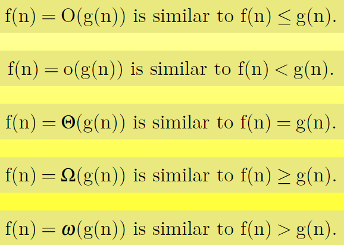
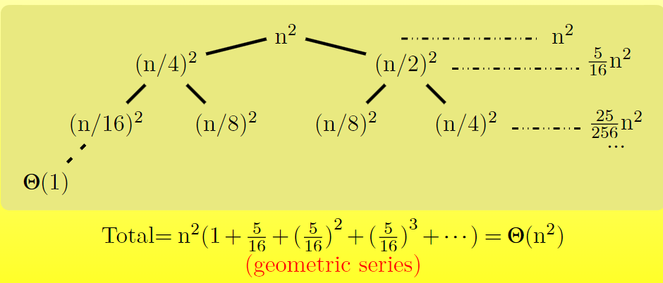

# 渐进标记和递归方程

## 渐进符号

### 定义

- \(\theta(g(n)) = \{ f(n) \mid \text{存在常数 } c_1 \text{ 和 } c_2 \text{ 以及正整数 } n_0, \text{ 使得 } 0 \leq c_1 g(n) \leq f(n) \leq c_2 g(n), \text{ 且 } n \geq n_0 \} \)

- \(O(g(n)) = \{ f(n) \mid \text{存在常数 } c \text{ 和正整数 } n_0, \text{ 使得 } 0 \leq f(n) \leq c g(n), \text{ 且 } n \geq n_0 \} \)

- \(\Omega(g(n)) = \{ f(n) \mid \text{存在常数 } c \text{ 和正整数 } n_0, \text{ 使得 } f(n) \geq c g(n) > 0, \text{ 且 } n \geq n_0 \} \)

简单来讲，可以按照下图进行记忆：

### 对称性 & 转置对称性

- \(f(n) = \Theta(g(n)) \text{ if and only if } g(n) = \Theta(f(n))\)
- \(f(n) = O(g(n)) \text{ if and only if } g(n) = \Omega(f(n))\)  
- \(f(n) = o(g(n)) \text{ if and only if } g(n) = \omega(f(n))\)

### 不完备性

\(f(n) = O(g(n))\),  \(f(n) = \Theta(g(n))\),\(f(n) = \Omega(g(n))\)可能都不满足，
例如\(g(n) = n^{1 - \sin(\frac{n \pi}{2})}\)

## 标准表示法和常用函数

### 上下界

\[x - 1 < \lfloor x 
floor \le x \le \lceil x 
ceil \le x + 1\]

### 取模

\[a mod n = a - n \lfloor a / n 
floor\]

### 等效

如果 \((a mod n) = (b mod n)\)，我们可以写作 \((a \equiv b)\)

### 指数

对于所有 \(a > 0\)，有：

- \(a^0 = 1\)
- \((a^m)^n = (a^n)^m = a^{mn}\)
- \(a^m a^n = a^{m+n}\)

当 \(a > 1\) 时，\(\lim_{n \to \infty} \frac{n^b}{a^n} = 0\)。也就是说，\(n^b = o(a^n)\)。

对于所有实数 \(x\)，
\[
e^x = 1 + x + \frac{x^2}{2!} + \frac{x^3}{3!} + \cdots = \sum_{i=0}^{\infty} \frac{x^i}{i!}\]

当 \(|x| \le 1\) 时，
\[1 + x \le e^x \le 1 + x + x^2\]

当 \(x \to 0\) 时，
\[e^x = 1 + x + \Theta(x^2)\]

对于所有 \(x\)，
\[\lim_{n \to \infty} \left(1 + \frac{x}{n}\right)^n = e^x\]

### 对数

- \(\lg n = \log_2 n\)
- \(\ln n = \log_e n\)
- \(\lg^k n = (\lg n)^k\)
- \(\lg \lg n = \lg (\lg n)\)

对于所有实数 \(a, b, c > 0\) 和 \(n\)，有：

- \(a = b^{\log_b a}\)
- \(\log_c (ab) = \log_c a + \log_c b\)
- \(\log_b (a^n) = n \log_b a\)
- \(\log_b a = \frac{\lg a}{\lg b}\)
- \(a^{\log_b c} = c^{\log_b a}\)

当 \(a > 0\) 时，
\[\lim_{n \to \infty} \frac{\lg^b n}{n^a} = 0\]
也就是说，\(\lg^b n = o(n^a)\)。

当 \(|x| \le 1\) 时，
\[\ln(1 + x) = x - \frac{x^2}{2} + \frac{x^3}{3} - \frac{x^4}{4} + \frac{x^5}{5} - \cdots\]

当 \(x > -1\) 时，
\[\frac{x}{1+x} \le \ln(1 + x) \le x\]

### 阶乘

\(n!\) 的定义为：
\[
  n! = \begin{cases}
    1 & \text{if } n = 0 \\
    n \cdot (n - 1)! & \text{if } n > 0
  \end{cases}
\]

阶乘的上界：
\[n! \le n^n\]

更好的上界：斯特林近似公式
\[n! = \sqrt{2 \pi n} \left( \frac{n}{e} \right)^n \left(1 + \Theta\left( \frac{1}{n} \right)\right)\]

### 函数迭代

我们使用记号 \(f^{(i)}(n)\) 来表示函数 \(f(n)\) 对初始值 \(n\) 迭代应用 \(i\) 次后的结果。形式上，设 \(f(n)\) 是一个实数函数，对于非负整数 \(i\)，递归定义如下：
\[
  f^{(i)}(n) = \begin{cases}
    n & \text{if } i = 0 \\
    f(f^{(i-1)}(n)) & \text{if } i > 0
  \end{cases}
\]
**迭代对数函数**

我们使用记号 \(\lg^*n\) 来表示迭代对数。
\[
  \lg^* n = \min \{i \ge 0 : \lg^{(i)} n \le 1 \}
\]

### 斐波那契数列

我们定义斐波那契数列如下：

- \(F_0 = 0\)
- \(F_1 = 1\)
- \(F_i = F_{i-1} + F_{i-2}\)，对于 \(i \ge 2\)

### 替代法

替代法（Substitution Method）是解决递归方程的最通用的方法之一。其核心思想是通过猜测递归方程解的形式，然后利用数学归纳法验证这一猜测是否成立。替代法不仅可以用来确定递归方程的上界（Big-O）或下界（Big-Omega），在某些情况下也能确定精确的渐近界（Theta）。

#### 替代法的步骤

1. **猜测解决方案的形式**：基于递归方程的结构，猜测其解的形式。例如，多项式、对数或指数函数等。
2. **通过求解常数来验证猜测**：利用数学归纳法，假设对于较小的输入规模，递归关系成立，然后证明对于任意的 \( n \)，递归关系依然成立。

需要注意的是，替代法的有效性依赖于我们能够合理地猜测出解的形式。

#### 例子分析

考虑以下递归方程：
\[
T(n) = 4T\left(\frac{n}{2}\right) + n
\]

我们将通过替代法来确定其渐近上界和下界。

##### 1. 确定上界

**初步猜测**：假设 \( T(n) = O(n^3) \)

- **基准情况**：设 \( T(1) = \Theta(1) \)
- **归纳假设**：假设对于所有 \( k < n \)，都有 \( T(k) \leq c k^3 \)，其中 \( c \) 是一个常数。
- **归纳步骤**：
  \[
  \begin{aligned}
  T(n) &= 4T\left(\frac{n}{2}\right) + n \\
       &\leq 4c\left(\frac{n}{2}\right)^3 + n \\
       &= 4c \cdot \frac{n^3}{8} + n \\
       &= \frac{c}{2}n^3 + n \\
       &= c n^3 - \left(\frac{c}{2}n^3 - n\right)
  \end{aligned}
  \]
  
  为了确保 \( T(n) \leq c n^3 \)，需要满足：
  \[
  \frac{c}{2}n^3 - n \geq 0
  \]
  这在 \( c \geq 2 \) 且 \( n \geq 1 \) 时成立。

- **处理初始条件**：通过基准情况支撑归纳，即对于所有 \( n < n_0 \)，选择足够大的 \( c \) 使得 \( \Theta(1) \leq c n^3 \) 成立。

然而，这个上界并不紧。

##### 2. 更紧的上界

为了找到一个更紧的上界，我们尝试证明 \( T(n) = O(n^2) \)。

- **新的猜测**：假设 \( T(n) = O(n^2) \)
- **归纳假设**：假设对于所有 \( k < n \)，都有 \( T(k) \leq c k^2 \)。
- **归纳步骤**：
  \[
  \begin{aligned}
  T(n) &= 4T\left(\frac{n}{2}\right) + n \\
       &\leq 4c\left(\frac{n}{2}\right)^2 + n \\
       &= 4c \cdot \frac{n^2}{4} + n \\
       &= c n^2 + n \\
       &= O(n^2)
  \end{aligned}
  \]
  
  但是，这个结论并不严谨，因为我们需要更严格地证明归纳假设的有效性。

##### 3. 上界的改进

**改进思路**：强化归纳假设，减去一个低阶项以确保不等式成立。

- **强化后的归纳假设**：
  \[
  T(k) \leq c_1 k^2 - c_2 k \quad \text{对于所有 } k < n
  \]
  
- **归纳步骤**：
  \[
  \begin{aligned}
  T(n) &= 4T\left(\frac{n}{2}\right) + n \\
       &\leq 4\left(c_1 \left(\frac{n}{2}\right)^2 - c_2 \left(\frac{n}{2}\right)\right) + n \\
       &= 4 \left( \frac{c_1 n^2}{4} - \frac{c_2 n}{2} \right) + n \\
       &= c_1 n^2 - 2 c_2 n + n \\
       &= c_1 n^2 - (2 c_2 - 1) n
  \end{aligned}
  \]
  
  为了确保 \( T(n) \leq c_1 n^2 - c_2 n \)，需要：
  \[
  2 c_2 - 1 \geq c_2 \quad \Rightarrow \quad c_2 \geq 1
  \]
  
  选择 \( c_2 \geq 1 \) 即可满足条件。同时，选择足够大的 \( c_1 \) 来处理初始条件。

#### 确定下界

接下来，我们证明 \( T(n) = \Omega(n^2) \)。

- **猜测下界**：假设 \( T(n) \geq c n^2 \)
- **归纳假设**：对于所有 \( k < n \)，都有 \( T(k) \geq c k^2 \)。
- **归纳步骤**：
  \[
  \begin{aligned}
  T(n) &= 4T\left(\frac{n}{2}\right) + n \\
       &\geq 4c \left(\frac{n}{2}\right)^2 + n \\
       &= 4c \cdot \frac{n^2}{4} + n \\
       &= c n^2 + n \\
       &\geq c n^2
  \end{aligned}
  \]
  
  这里需要确保 \( n \geq 0 \)，对于所有 \( n \geq 1 \)，上述不等式成立。

#### 综合分析

通过上述步骤，我们已经分别确定了递归方程 \( T(n) = 4T\left(\frac{n}{2}\right) + n \) 的上界和下界均为 \( \Theta(n^2) \)。因此，最终的渐近解为：
\[
T(n) = \Theta(n^2)
\]

### 递归树法

递归树方法（Recursion Tree Method）用于建模算法递归执行时的成本（时间复杂度）。通过可视化递归调用的层次结构，递归树帮助我们理解递归方程的行为和总成本。

#### 递归树方法的优缺点

- **优点**：
  - 递归树方法是为替代法（Substitution Method）生成猜测的良好工具。
  - 通过直观的树形结构，易于理解递归调用的分布和成本分配。

- **缺点**：
  - 递归树方法有时可能不够精确，尤其是在复杂递归关系中。
  - 对于某些递归方程，递归树方法可能无法提供有效的渐近界。

#### 例子：递归树的应用

**问题**：求解递归方程 \( T(n) = T\left(\frac{n}{4}\right) + T\left(\frac{n}{2}\right) + n^2 \)

通过递归树方法，可以将递归调用展开为树状结构，计算每一层的成本，并最终汇总所有层的成本以确定总时间复杂度。

### 主方法（Master Method）

主方法（Master Method）是一种用于解决特定形式递归方程的强大工具。它适用于分治算法中的常见递归关系，能够快速确定递归方程的渐近复杂度。

#### 主方法的适用范围

主方法适用于以下形式的递归方程：
\[
T(n) = aT\left(\frac{n}{b}\right) + f(n)
\]
其中：
- \( a \geq 1 \) 是子问题的数量。
- \( b > 1 \) 是子问题规模的缩减因子。
- \( f(n) \) 是合并子问题解所需的额外成本，且 \( f(n) \) 是渐近正函数。

#### 主方法的三种常见情况

主方法通过比较 \( f(n) \) 与 \( n^{\log_b a} \) 的增长率来确定递归方程的解。具体分为以下三种情况：

1. **情况 1**：
   \[
   f(n) = O\left(n^{\log_b a - \epsilon}\right) \quad \text{对于某个常数 } \epsilon > 0
   \]
   - **解释**：\( f(n) \) 的增长速度比 \( n^{\log_b a} \) 稍慢，多了一个 \( n^{\epsilon} \) 因子。
   - **解**：\( T(n) = \Theta\left(n^{\log_b a}\right) \)

2. **情况 2**：
   \[
   f(n) = \Theta\left(n^{\log_b a} \cdot \log^k n\right) \quad \text{对于某个常数 } k \geq 0
   \]
   - **解释**：\( f(n) \) 与 \( n^{\log_b a} \) 的增长率相似，仅差一个对数因子。
   - **解**：\( T(n) = \Theta\left(n^{\log_b a} \cdot \log^{k+1} n\right) \)

3. **情况 3**：
   \[
   f(n) = \Omega\left(n^{\log_b a + \epsilon}\right) \quad \text{对于某个常数 } \epsilon > 0
   \]
   - **解释**：\( f(n) \) 的增长速度比 \( n^{\log_b a} \) 稍快，多了一个 \( n^{\epsilon} \) 因子。
   - **额外条件**：\( f(n) \) 满足正则条件，即存在常数 \( c < 1 \)，对于所有足够大的 \( n \)，都有 \( a f\left(\frac{n}{b}\right) \leq c f(n) \)。
   - **解**：\( T(n) = \Theta\left(f(n)\right) \)

#### 主方法的应用示例

##### 示例 1：\( T(n) = 4T\left(\frac{n}{2}\right) + n \)

- **参数**：\( a = 4 \)，\( b = 2 \)，\( f(n) = n \)
- **计算**：\( n^{\log_b a} = n^{\log_2 4} = n^2 \)
- **比较**：\( f(n) = O\left(n^{2 - 1}\right) = O(n) \)，符合**情况 1**。
- **结论**：\( T(n) = \Theta(n^2) \)

##### 示例 2：\( T(n) = 4T\left(\frac{n}{2}\right) + n^2 \)

- **参数**：\( a = 4 \)，\( b = 2 \)，\( f(n) = n^2 \)
- **计算**：\( n^{\log_b a} = n^2 \)
- **比较**：\( f(n) = \Theta\left(n^2 \cdot \log^0 n\right) = \Theta(n^2) \)，符合**情况 2**，其中 \( k = 0 \)。
- **结论**：\( T(n) = \Theta(n^2 \log n) \)

##### 示例 3：\( T(n) = 4T\left(\frac{n}{2}\right) + n^3 \)

- **参数**：\( a = 4 \)，\( b = 2 \)，\( f(n) = n^3 \)
- **计算**：\( n^{\log_b a} = n^2 \)
- **比较**：\( f(n) = \Omega\left(n^{2 + 1}\right) = \Omega(n^3) \)，符合**情况 3**。
- **正则条件验证**：
  \[
  4\left(\frac{n}{2}\right)^3 = 4 \cdot \frac{n^3}{8} = \frac{n^3}{2} \leq \frac{1}{2} n^3
  \]
  满足 \( c = \frac{1}{2} < 1 \)。
- **结论**：\( T(n) = \Theta(n^3) \)

##### 示例 4：\( T(n) = 4T\left(\frac{n}{2}\right) + \frac{n^2}{\log n} \)

- **参数**：\( a = 4 \)，\( b = 2 \)，\( f(n) = \frac{n^2}{\log n} \)
- **计算**：\( n^{\log_b a} = n^2 \)
- **比较**：\( f(n) = \Omega\left(n^{2 + \epsilon}\right) \) 不成立，因为对于任何 \( \epsilon > 0 \)，\( n^{\epsilon} = \omega(\log n) \)。
- **结论**：主方法不适用。

### 附录：几何级数

几何级数在分析递归方程时常常出现，特别是在递归树方法中。以下是几何级数的一些基本公式：

1. **有限几何级数**：
   \[
   1 + x + x^2 + \cdots + x^n = \frac{1 - x^{n+1}}{1 - x} \quad \text{当 } x \neq 1
   \]

2. **无限几何级数**：
   \[
   1 + x + x^2 + \cdots = \frac{1}{1 - x} \quad \text{当 } |x| < 1
   \]

这些公式在计算递归树的总成本时非常有用，特别是在处理等比数列时。
