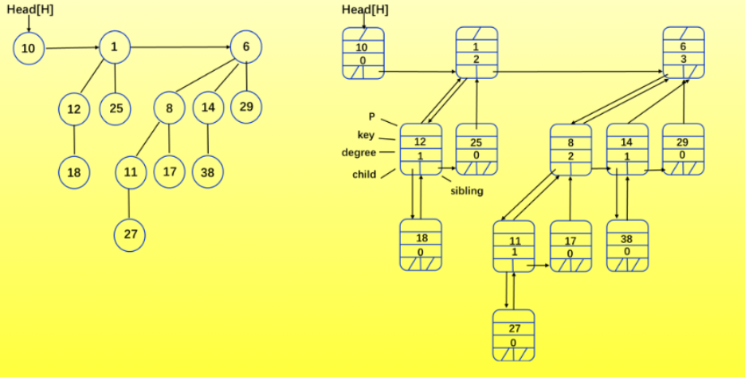

# 高级数据结构（2）

## 二项式堆

一些能够支持如下操作的数据结构：
MAKE-HEAP() -- 创建一个空堆
INSERT(H,x) -- 向堆中插入一个元素x
MINIMUM(H) -- 返回堆中的最小元素
EXTRACT-MIN(H) -- 从堆中取出最小元素
UNION(H1,H2) -- 合并两个堆

一些其他操作：
DECREASE-KEY(H,x,k) -- 将元素x的值减小为k
DELETE(H,x) -- 从堆中删除元素x

应用：Dijkstra算法，Prim的MST算法，事件驱动仿真，Huffman树编码等。

对于不同数据结构，各个操作的时间复杂度如下：

Operation | Linked List | Binary Tree | Binomial Heap | Fibonacci Heap | Relaxed Heap |
---|---|---|---|---|---|
make-heap() | 1 | 1 | 1 | 1 | 1 |
insert(x) | O(1) | O(log n) | O(log n) | O(1) | O(1) |
find-min() | O(n) | O(1) | O(log n) | O(1) | O(1) |
delete-min | O(n) | O(log n) | O(log n) | O(log n) | O(log n) |
union | O(1) | O(n) | O(log n) | O(1) | O(1) |
decrease-key | O(1) | O(log n) | O(log n) | O(1) | O(1) |
delete | O(n) | O(log n) | O(log n) | O(log n) | O(log n) |
is-empty() | O(1) | O(1) | O(1) | O(1) | O(1) |

二项式树的定义：
递归定义：B0是单个节点，Bk由两个Bk-1合并而成，一棵树的根作为另外一个的左子树。

性质：
对于k阶二项式树Bk：

1. 节点数为2^k
2. 高度为k
3. 根的度数为k
4. 删除Bk-1到B0的根
5. Bk有(k i) 个节点，在深度为i处。

二项式堆定义：
满足二项式堆性质的二项式树序列：

1. 每棵树都是最小堆序的
2. 可以包含0个或1个k阶二项式树

二项式堆的实现：
每个结点使用左孩子、右兄弟、父结点指针，以及一个域，用来存储键值。

使用一个链表链接所有的根节点，当我们遍历根列表时，树的度数严格递增。

```cpp
struct BinomialHeapNode{
    int key;
    shared_ptr<BinomialHeapNode> child;
    shared_ptr<BinomialHeapNode> sibling;

    BinomialHeapNode(int key):key(key),child(nullptr),sibling(nullptr){}
}

具体例子如下图所示：



性质：
N个结点的二项式堆：

1. 最小的键值在B0到Bk的根中
2. N=sigma i=0,log N（向下取整） bi*2^i ,参考将N写成二进制的方法
3. 最多有log N（向下取整）+1个树
4. 树的高度<=log N（向下取整）+1(因为高度最大阶数为⌊logN⌋)

二项式堆的合并：
创建一个新的二项式堆，将两个堆的根节点链接起来。（O(1)）

1. 可合并的堆
2. 如果都是k阶二项式树，那么直接连接根节点，选择更小的根作为新的根。

```cpp
NodePtr mergeBinomialTrees(NodePtr tree1,NodePtr tree2){
    if(!tree1||!tree2){
        return tree1?tree1:tree2;
    }
    
    if(tree1->key > tree2->key){
        swap(tree1,tree2);//确保tree1是更小的树
    }

    tree2->sibiling = tree1->child;
    tree1->child = tree2;

    return tree1;
}
```

时间复杂度：𝑂(log𝑁)
两个二项式堆的树个数和最多为：
⌊
log
⁡
𝑁
′
⌋
+
1
⌊logN
′
 ⌋+1 和
⌊
log
⁡
𝑁
′
′
⌋
+
1
⌊logN
′′
 ⌋+1
，由于合并时需要遍历两个堆中的每一阶树，并处理相同阶树的合并，所以时间复杂度为O(logN)。

二项式堆删除最小节点：

1. 在根列表中，找到最小的根x,然后删除。
2. 断开的二项式树H'，未受到影响的二项式堆剩余部分H''
3. 合并H'和H''，得到新的堆H 

```cpp
NodePtr deleteMinBinomialHeap(NodePtr heap){
    if(!H) return nullptr;

    NodePtr prevMin = nullptr;
    NodePtr min = heap;
    NodePtr prev = nullptr;
    NodePtr curr = heap;

    int minKey=INT_MAX;
    //找到最小节点
    while(curr){
        if(curr->key <minKey){
            minKey = curr->key;
            prevMin = prev;
            minNode = curr;
        }
        prev =curr;
        curr=curr->sibling;
    }
    //断开最小节点
    if(prevMin){
        prevMin->sibling = minNode->sibling;
    }else{
        heap=minNode->sibling;
    }
    //整理剩余的树
    NodePtr child =minNode->child;
    NodePtr newHeap = nullptr;
    while(child){
        NodePtr nextChild = child->sibling;
        child->sibling = newHeap;//这样实现会让先加入的子树在链表尾部
        newHeap = child;
        child = nextChild;
    }
    return mergeBinomialHeaps(heap,newHeap);
}
```

时间复杂度：𝑂(log𝑁)

二项式堆降低键值：
减少堆中x的键值：

1. 假设 x 在二项式树Bk中
2. 修改x的键值，如果键值太小就通过向上冒泡的方式修改树结构，直到满足二项式堆的性质。

```cpp
void decreaseKey(NodePtr x,int k){
    if(!x) return;

    if(newKey > x->key){
        cout<<"new key is greater than current key"<<endl;
        return;
    }

    node->key = k;
    NodePtr curr = x;
    NodePtr parent = curr->parent.lock();

    while(parent&&curr->key < parent->key){
        swap(curr->key,parent->key);
        curr = parent;
        parent = curr->parent.lock();
    }
}
```

删除节点：

1. 将x的键值降低到负无穷大
2. 调用deleteMin(heap)

```cpp
NodePtr deleteNode(NodePtr heap,NodePtr x){
    decreaseKey(x,INT_MIN);
    return deleteMinBinomialHeap(heap);
}
```

时间复杂度：O(logN)

插入节点：

1. H' = MakeHeap(x);
2. H = Union(H,H');

```cpp
NodePtr insertNode(NodePtr heap,int key){
    NodePtr newNode = make_shared<BinomialTreeNode>(key);

    return mergeBinomialHeaps(heap,newNode);
}
```
时间复杂度：O(log N)

## 斐波那契堆

斐波那契堆的直观理解：

1. 类似于二项堆，但是结构比较松散
2. 减少键值和合并操作的时间复杂度为O(1)(摊还时间)
3. 采用“懒惰”的合并方式。（什么意思？）

