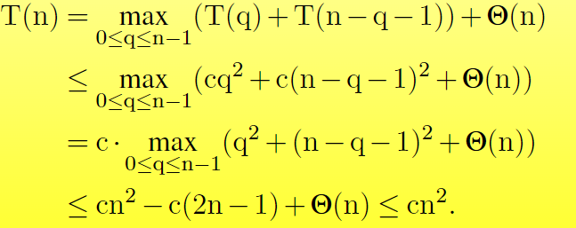
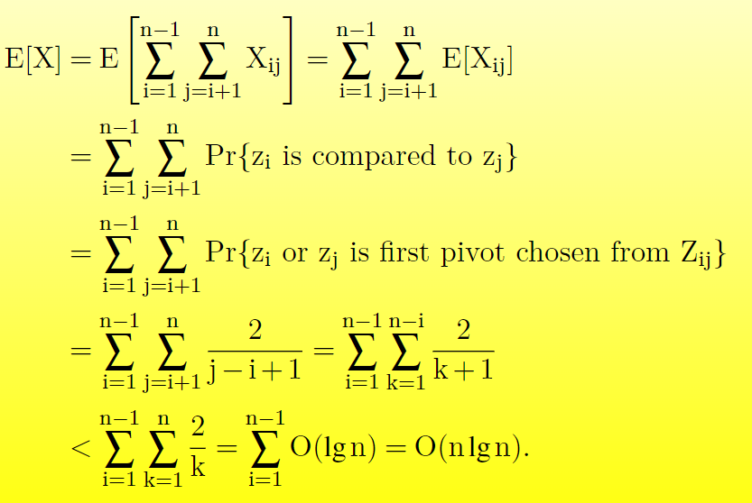
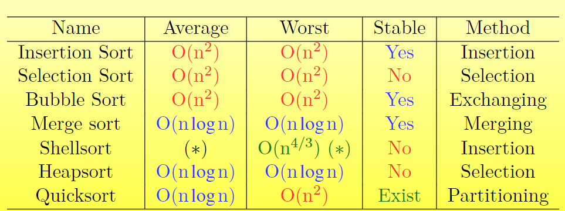

# 排序算法及其比较

## 基本概念

1. **稳定性**：在排序后，具有相同关键字的数据对象的相对顺序保持不变。
2. **时间复杂度**：通过比较次数和移动次数来衡量算法的效率。
3. **就地排序**：排序过程中不需要额外的存储空间。

如果感兴趣，可以进一步探究常见排序方法在上述三个方面的差异。

## 简单的排序算法

### 插入排序

插入排序的基本思路是维护一个有序的序列，每次将一个未排序的元素插入到有序序列中的适当位置。下面是代码实现：

```cpp
void InsertSort(vector& nums) {
    int n = nums.size();

    for(int j = 1; j &lt; n; j++) {
        int key = nums[j];
        int i = j - 1;
        // 将待插入元素插入前面的有序序列
        while(i &gt;= 0 && nums[i] &gt; key) {
            nums[i + 1] = nums[i];
            i--;
        }
        nums[i + 1] = key;
    }
}
```

**时间复杂度**：

- 最佳情况：O(n)
- 平均情况：O(n²)
- 最坏情况：O(n²)

**空间复杂度**：O(1)

**稳定性**：稳定。

### 选择排序

选择排序的基本思路是从未排序的集合中选择最小的元素，并将其放置在有序集合的末尾。以下是代码实现：

```cpp
void selectSort(vector& nums) {
    int n = nums.size();
    for(int i = 0; i &lt; n - 1; i++) {
        int min = i;
        for(int j = i + 1; j &lt; n; j++) {
            if(nums[j] &lt; nums[min]) {
                min = j;
            }
        }
        if(min != i) {
            swap(nums[i], nums[min]);
        }
    }
}
```

**时间复杂度**：

- 最佳情况：O(n²)
- 平均情况：O(n²)
- 最坏情况：O(n²)

**空间复杂度**：O(1)

**稳定性**：不稳定。

- **原因**：选择排序在交换元素时可能会打乱相同关键字元素的相对顺序。
- **改进方法**：为了使选择排序稳定，可以在找到最小元素后，将其插入到正确位置，而不是直接交换。这样可以保持相同关键字元素的相对顺序。

### 冒泡排序

冒泡排序的基本思路是通过多次遍历数组，每次比较相邻的两个元素并交换顺序不正确的元素，从而将最大（或最小）的元素“冒泡”到数组的一端。以下是代码实现：

```cpp
void BubbleSort(vector& nums) {
    int n = nums.size();
    for(int i = 0; i &lt; n - 1; i++) {
        bool noSwap = true;
        for(int j = n - 1; j &gt; i; j--) {
            if(nums[j] &lt; nums[j - 1]) {
                swap(nums[j], nums[j - 1]);
                noSwap = false;
            }
        }
        if(noSwap) {
            break; // 某轮循环未发生交换，说明已经有序，可以提前结束
        }
    }
}
```

**时间复杂度**：

- 最佳情况：O(n)
- 平均情况：O(n²)
- 最坏情况：O(n²)

**空间复杂度**：O(1)

**稳定性**：稳定。

## 高效的排序算法

### 希尔排序

希尔排序通过选择一个递减的间隔序列，将数组元素分组，对每组使用插入排序，以减少整体数据移动次数。以下是代码实现：

```cpp
void ShellSort(vector& A, vector& D) {
    for(int increment : D) {
        ShellPass(A, increment);
    }
}

void ShellPass(vector& A, int d) {
    int n = A.size();
    for(int i = d; i &lt; n; i++) {
        if(A[i] &lt; A[i - d]) {
            int key = A[i];

            int j = i - d;
            while(j &gt;= 0 && A[j] &gt; key) {
                // 在间隔d的有序序列中寻找插入位置
                A[j + d] = A[j];
                j -= d;
            }
            A[j + d] = key;
        }
    }
}
```

**时间复杂度**：

- 最佳、平均、最坏情况均依赖于间隔序列。
- 例如，当间隔序列为 $4^k + 3 \cdot 2^{k-1} + 1$ 时，时间复杂度为 O(n^{4/3}).

**空间复杂度**：O(1)

**稳定性**：不稳定。

- **原因**：分组后，具有相同关键字的元素可能会被分到不同的组内，导致相对顺序改变。

**为什么希尔排序通常执行得更快？**

- 对小规模的子数组进行插入排序时，虽然最坏情况下时间复杂度为 O(n²)，但实际操作中移动次数较少。
- 使用较大的间隔时，子数组较小且部分有序，整体排序效率较高。经过多次迭代后，数组大部分已排序，最后几轮排序效率高。

**如何选择间隔序列？**

1. **⌈$\frac{n}{2^k}$⌉**: 时间复杂度为 $\Theta(n^2)$
2. **$2 \lceil \frac{n}{2^{k+1}} \rceil + 1$**: 时间复杂度为 $\Theta(n^{3/2})$
3. **$2^k - 1$**: 时间复杂度为 $\Theta(n^{3/2})$
4. **$2^k + 1 \, (k \geq 0)$**: 时间复杂度为 $\Theta(n^{3/2})$
5. **形如 $2^p 3^q$ 的连续数（$p, q$ 为非负整数）**: 时间复杂度为 $\Theta(n \log^2 n)$
6. **希尔排序的时间复杂度下界**：
任何版本的希尔排序最坏情况下的时间复杂度至少为：

$$
\Omega \left( n \left( \frac{\log n}{\log \log n} \right)^2 \right)
$$

### 堆排序

**基本概念**：堆是一种特殊的完全二叉树数据结构，可以用数组来表示。对于结点i：

- **Parent(i)** 返回 $ ⌊i/2⌋ $
- **Left(i)** 返回 $2i$
- **Right(i)** 返回 $2i+1$

**最大堆性质**：对于所有非根节点i，满足 $A[\text{Parent}(i)] \geq A[i]$。

为了维护这一性质，需要比较根节点与其左右子节点，并在必要时进行交换。

```cpp
void MaxHeapify(vector& A, int i, int heapSize) {
    int l = 2 * i + 1; // 0-based index
    int r = 2 * i + 2; // 0-based index
    int largest = i;

    // 比较左子节点与当前节点，找出较大的节点
    if(l &lt; heapSize && A[l] &gt; A[largest]) {
        largest = l;
    }

    // 比较右子节点与当前最大节点，找出较大的节点
    if(r &lt; heapSize && A[r] &gt; A[largest]) {
        largest = r;
    }

    // 如果最大节点不是当前节点，则交换并继续堆化
    if(largest != i) {
        swap(A[i], A[largest]);
        MaxHeapify(A, largest, heapSize);
    }
}
```

**叶子节点性质**：
对于n元素的堆，叶子节点的索引范围为从 ⌊n/2⌋ 到 n-1。每个叶子节点本身已经是一个大小为1的最大堆。

```cpp
void BuildMaxHeap(vector& A) {
    int heapSize = A.size();
    // 从最后一个非叶子结点开始，向上调用MaxHeapify，0-based索引
    for(int i = (heapSize / 2) - 1; i &gt;= 0; i--) {
        MaxHeapify(A, i, heapSize);
    }
}
```

**堆排序算法**：
堆排序的基本思路是将数组构建为一个最大堆，然后反复将堆顶元素（最大值）与堆的最后一个元素交换，并缩小堆的范围，继续堆化。

```cpp
void HeapSort(vector& A) {
    BuildMaxHeap(A);
    int heapSize = A.size();
    // 从最后一个元素开始，每次将堆顶元素与最后一个元素交换，然后重新堆化
    for(int i = heapSize - 1; i &gt; 0; i--) {
        swap(A[0], A[i]);
        heapSize--;
        MaxHeapify(A, 0, heapSize);
    }
}
```

**时间复杂度**：

- **Max-Heapify**: O(log n)
- **Build-Max-Heap**: O(n)
- **总体**：
  - 最佳情况：O(n log n)
  - 平均情况：O(n log n)
  - 最坏情况：O(n log n)

**空间复杂度**：O(1)

**稳定性**：不稳定。

**优先级队列简介**：
优先级队列是一种数据结构，用于维护一组具有优先级（键值）的元素。最大优先级队列支持以下操作：

- **Insert(S, x)**：将元素x插入集合S。
- **Maximum(S)**：返回集合S中具有最大键值的元素。
- **Extract-Max(S)**：移除并返回集合S中具有最大键值的元素。
- **Increase-Key(S, x, k)**：将元素x的键值增加到新值k，假设k不小于x当前的键值。

```cpp
int heapMaximum(vector& A) {
    return A[0];
}

int heapExtractMax(vector& A) {
    int max = A[0];
    A[0] = A[A.size() - 1];
    A.pop_back(); // 减少堆的大小
    MaxHeapify(A, 0, A.size());
    return max;
}

void heapIncreaseKey(vector& A, int i, int key) {
    if(key &lt; A[i]) {
        throw "new key is smaller than current key";
    }
    A[i] = key;
    while(i &gt; 0 && A[(i - 1) / 2] &lt; A[i]) {
        swap(A[i], A[(i - 1) / 2]);
        i = (i - 1) / 2;
    }
}

void maxHeapInsert(vector& A, int key) {
    A.push_back(std::numeric_limits::min()); // 在堆的末尾插入一个很小的值
    heapIncreaseKey(A, A.size() - 1, key); // 增加新插入的键值为 'key'
}
```

### 快速排序

**基本思路**：选择一个基准元素，将数组分成两部分，小于或等于基准的元素放在左边，大于基准的元素放在右边，然后对这两部分递归进行快速排序。

```cpp
void quickSort(vector& A, int p, int r) {
    if(p &lt; r) {
        // 分区并获取枢轴的位置
        int q = partition(A, p, r);
        // 对左右两部分分别递归调用快速排序
        quickSort(A, p, q - 1);
        quickSort(A, q + 1, r);
    }
}

int partition(vector& A, int p, int r) {
    int x = A[r];
    int i = p - 1; // 指向小于等于枢轴的元素的位置

    for(int j = p; j &lt; r; j++) {
        if(A[j] &lt;= x) {
            i++; // 此时i+1就是当前小于等于枢轴的元素的下一个位置
            swap(A[i], A[j]);
        }
    }
    swap(A[i + 1], A[r]);
    return i + 1;
}
```

**时间复杂度**：

- **最坏情况**：当每次分区都产生一个大小为n-1和0的子问题，时间复杂度为 O(n²)。
- **最佳情况**：每次分区都将数组均匀分成两部分，时间复杂度为 O(n log n)。
- **平均情况**：通常情况下，时间复杂度为 O(n log n)。

**随机化快速排序**：
通过随机选择基准元素，可以有效避免最坏情况的发生。

```cpp
void randomizedQuickSort(vector& A, int p, int r) {
    if(p &lt; r) {
        int q = randomizedPartition(A, p, r);
        randomizedQuickSort(A, p, q - 1);
        randomizedQuickSort(A, q + 1, r);
    }
}

int randomizedPartition(vector& A, int p, int r) {
    int i = p + std::rand() % (r - p + 1); // 在 p 和 r 之间随机选择一个索引
    swap(A[i], A[r]);
    return partition(A, p, r); // 调用之前的分区函数
}
```

**时间复杂度分析**：

- **最坏情况**：分区不均匀，每次递归产生一个大小为n-1和0的子问题，导致时间复杂度为 O(n²)，证明如下图所示：
    
- **平均情况**：分区较为均匀，时间复杂度为 O(n log n)。证明如下图所示：
    
**空间复杂度**：

- **平均情况**：O(log n)
- **最坏情况**：O(n)

**稳定性**：不稳定。

**如何实现稳定的快速排序？**

可以通过在分区过程中保持相等元素的相对顺序，例如使用额外的辅助数组来存储小于、等于和大于基准的元素，从而实现稳定的快速排序。

**排序算法总结**：


