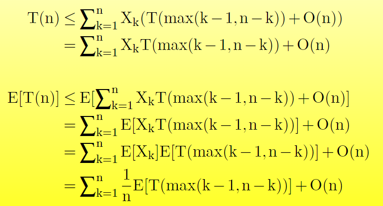

# 中位数和顺序统计

本章解决从一组n个不同数字中选择第i号的数（即恰好有i-1个数小于它）。

## 最大数和最小数

要确定一组 n 个元素的最小值，比较的下限为 n − 1。

```cpp
int minimum(const vector<int>& A){
    int min = A[0];
    for(int i=1;i<A.size();i++){
        if(min>A[i]){
            min=A[i];
        }
    }

    return min;
}
```

一些应用中我们需要同时找到最大和最小，一个简答的办法是各用n-1次比较找到最大和最小，事实上，我们最多用3⌊n/2⌋次比较就可以找到。

```cpp
std::pair <int, int> maxmin(const vector<int>& A){
    int n=A.size();
    int min,max;

    if(A[0]>A[1]){
        min=A[1];
        max=A[0];
    }else{
        min=A[0];
        max=A[1];
    }

    for(int i=1;i<n/2;i++){
        idx1=2*i;
        idx2=2*i+1;

        if(A[idx1]>A[idx2]){
            if(A[idx1]>max){
                max=A[idx1];
            }
            if(A[idx2]<min){
                min=A[idx2];
            }else{
                if(A[idx2]>max){
                    max=A[idx2];
                }
                if(A[idx1]<min){
                    min=A[idx1];
                }
            }
        }
    }

    if(n%2!=0){
        if(A[n-1]>max){
            max=A[n-1];
        }
        if(A[n-1]<min){
            min=A[n-1];
        } 
    }

    return {min,max};
}
```

比较次数：
如果n是奇数，每轮比较3次，一共⌊n/2⌋轮，总共3⌊n/2⌋次。
如果n是偶数，总共3（n − 2）/2 次比较。
所以，最多有3⌊n/2⌋次比较。

## 预期线性时间的选择

分治思想的选择算法：RANDOMIZED_SELECT。
像快排一样，递归地对数组进行分区，区别在于RANDOMIZED_SELECT只需要对一遍递归分区，快速排序的预期运行时间为 Θ（n log n），但 RANDOMIZED-SELECT 的预期时间为 Θ（n）。

```cpp
int randomized_select(vector<int> &A, int p, int r, int i) {
    if(p==r){
        return A[p];
    }
    int q=randomized_partition(A,p,r);
    int k=q-p+1;

    if(i==k){
        return A[q];
    }else if(i<k){
        return randomized_select(A,p,q-1,i);
    }else{
        return randomized_select(A,q+1,r,i-k);
    }
}

int randomized_partition(vector<int> &A, int p, int r) {
    int i=p+rand()%(r-p+1);
    swap(A[i],A[r]);
    int pivot=A[r];
    int j=p-1;
    
    for(int k=p;k<r;k++){
        if(A[k]<=pivot){
            j++;
            swap(A[j],A[k]);
        }
    }

    swap(A[j+1],A[r]);
    return j+1;
}
```

时间复杂度：
即使是找最小值，最坏情况的运行时间也是O(n^2),因为我们可能总是围绕最大的剩余元素进行分区，而且每次分区都需要Θ(n)时间。但是，RANDOMIZED_SELECT的时间复杂度期望是Θ(n)。
证明：
随机变量Xk = I{ the subarray A[p . . . q] has exactly k elements }
则E[Xk] = 1/n，因为Xk在特定值上取1，其他取0。对于Xk=1的情况，我们可以递归两个子数组，大小分别为k-1和n-k，现在求E[Xk]。
