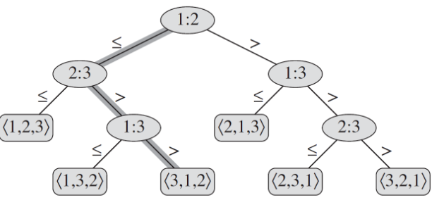

# 线性时间排序

## 排序算法复杂度下限

之前我们介绍的几种排序算法，它们的时间复杂度都达到了 Ω(n log n)，它们有一个共同的特点：这些排序算法的确定顺序仅基于输入元素之间的比较。

### 比较排序的决策树模型

在比较排序中，我们可以假设输入的所有元素都是不同的，对于任意两个元素 \( a_i \) 和 \( a_j \)，要么 \( a_i < a_j \)，要么 \( a_i > a_j \)。将这些比较操作表示成决策树，举个简单的例子，如下图所示：



决策树的每个内部节点表示一次比较，每个叶子节点表示一种可能的排序结果。决策树的路径从根到叶子对应于一种具体的比较序列。

### 决策树的高度与比较次数

从决策树的根到任何可到达的叶子的最长简单路径的长度，表示相应排序算法在最坏情况下的比较次数。因此，每个排列都对应一个叶子节点，决策树的高度下限反映了任何比较排序算法的运行时间下限。

### 定理：比较排序的时间下界

**定理**：在最坏的情况下，任何比较排序算法都需要 Ω(n log n) 次比较。

**证明**：

考虑一个高度为 \( h \) 的决策树，其中 \( l \) 个可到达叶子对应于 \( n \) 个元素的所有可能排列。由于每个比较序列可能对应多个叶子节点，因此有 \( n! \leq l \)。另一方面，具有高度为 \( h \) 的二叉树，其叶子节点数最多为 \( 2^h \)。因此，我们有：

\[
n! \leq l \leq 2^h
\]

取对数后得到：

\[
\log(n!) \leq h \cdot \log 2
\]

利用斯特林公式（Stirling's approximation），我们知道：

\[
\log(n!) = \Theta(n \log n)
\]

因此，

\[
h = \Omega(n \log n)
\]

这证明了在最坏情况下，任何比较排序算法的比较次数至少为 Ω(n log n)。

## 计数排序

假设：对于某个整数 k，n 个输入元素中的每一个都是 0 到 k 范围内的整数。

基本思想：对于每个输入元素 \( x \)，计算小于等于 \( x \) 的元素个数。我们需要一个输入数组 \( A[1 \ldots n] \)，以及另外两个数组：数组 \( B[1 \ldots n] \) 保存排序后的输出，数组 \( C[1 \ldots k] \) 统计小于等于各个元素的元素个数。

```cpp
void countingSort(const vector<int>& A, vector<int>& B, int k) {
    vector<int> C(k + 1, 0); // 初始化计数数组C，长度为k+1，初始值为0，Θ(k)

    // 统计每个元素出现的次数, Θ(n)
    for (int j = 0; j < A.size(); j++) {
        C[A[j]]++;
    }

    // 统计小于等于i的元素个数, Θ(k)
    for (int i = 1; i <= k; i++) {
        C[i] += C[i - 1];
    }

    // 将元素插入B中，Θ(n)
    for (int j = A.size() - 1; j >= 0; j--) {
        B[C[A[j]] - 1] = A[j];
        C[A[j]]--; // 确保相同元素按正确顺序放置
    }
}
```

**时间复杂度**：Θ(n + k)  
**稳定性**：稳定。

## 基数排序

基本思想：整理牌机器模型：对 \( n \) 张卡片进行 \( d \) 位数字排序。首先按照最低有效数字排序，然后组成一副牌，然后按照次低有效数字排序，再组成一副牌，依次类推，直到最高有效数字。

假设：每个元素都有 \( d \) 位，第 1 位是最低位，第 \( d \) 位是最高位。

```cpp
void Sortedindex(const vector<int>& A, vector<int>& C, int k) {
    for (int j = 0; j <= k; j++) {
        C[j] = 0;
    }
    for (int i = 0; i < A.size(); i++) {
        C[A[i]]++;
    }
    for (int j = 1; j <= k; j++) {
        C[j] += C[j - 1];
    }
}

void radixSort(vector<int>& A, int d) {
    int n = A.size();
    int k = 9;

    for (int i = 1; i <= d; i++) {
        vector<int> digitA(n);

        // 获取第 i 位数字（从最低位到最高位）
        for (int j = 0; j < n; j++) {
            digitA[j] = (A[j] / static_cast<int>(pow(10, i - 1))) % 10;
        }

        vector<int> C(k + 1);
        // 获取每个元素排序后的位置
        Sortedindex(digitA, C, k);

        // 更新A为按当前位排序后的结果
        vector<int> sortedA(n);
        for (int j = 0; j < n; j++) {
            sortedA[C[digitA[j]] - 1] = A[j];
            C[digitA[j]]--;
        }
        A = sortedA;
    }
}
```

**时间复杂度**：

- 每轮需要 $Θ(n + k)$
- 一共有 \( d \) 位，所以有 \( d \) 轮，因此总时间复杂度为 $Θ(d(n + k))$

对于给定的 \( n \) 个 \( b \) 位数和任意正整数 \( r \leq b \)，基数排序的时间复杂度为 $Θ((b/r)(n + 2^r))$。

如何选择最优的 \( r \)：

- 如果 \( b < \lfloor \log n \rfloor \)，选择 \( r = b \) 则运行时间为 Θ(n)。
- 如果 \( b \geq \lfloor \log n \rfloor \)，选择 \( r = \lfloor \log n \rfloor \) 则运行时间为 $Θ(bn / \log n)$。

基数排序是否比基于比较的排序算法（如快速排序）更有效？

- 如果 \( b = O(\log n) \) 且 \( r \approx \log n \)，则基数排序的运行时间为 Θ(n)，这比快速排序的平均运行时间 $Θ(n log n)$ 要好。
- 尽管基数排序的循环轮数更少，但每轮循环的时间可能更长。

选择排序算法需要根据实现、机器特性和输入数据的特性。例如，基数排序无法就地排序，而很多其他排序算法可以做到，当机器存储开销较高时，更倾向于选择就地排序算法。

## 桶排序

输入：从区间 \([0, 1)\) 上的均匀分布中提取的。
基本思想：桶排序将区间 \([0, 1)\) 划分为 \( n \) 个大小相等的子区间或桶，然后将 \( n \) 个输入数字分配到桶中。最后，对每个桶中的数字进行排序，然后按顺序遍历所有桶并列出每个桶中的元素。

```cpp
void bucketSort(vector<float>& A) {
    int n = A.size();
    vector<vector<float>> bucket(n); // 创建n个空桶

    // 将元素插入对应的桶中
    for (int i = 0; i < n; i++) {
        int bucketIndex = static_cast<int>(n * A[i]); // 计算元素所属的桶索引
        bucket[bucketIndex].push_back(A[i]);
    }

    // 对每个桶中的元素进行排序
    for (int i = 0; i < n; i++) {
        sort(bucket[i].begin(), bucket[i].end()); // 使用插入排序对每个桶进行排序（这里直接用标准库的sort模拟）
    }

    // 将所有桶中的元素合并到A中
    int index = 0;
    for (int i = 0; i < n; i++) {
        for (int j = 0; j < bucket[i].size(); j++) {
            A[index++] = bucket[i][j];
        }
    }
}
```

**时间复杂度**：
假设随机变量 \( n_i \) 是第 \( i \) 个桶中的元素个数，则时间复杂度为：

\[
T(n) = \Theta(n) + \sum_{i=0}^{n-1} O(n_i^2)
\]

期望时间复杂度为：

\[
E[T(n)] = \Theta(n) + \sum_{i=0}^{n-1} O(E[n_i^2]) = \Theta(n) + nO(2 - \frac{1}{n}) = \Theta(n)
\]
**证明**：
定义指示随机变量。对于 \(i = 0, 1, \ldots, n - 1\) 和 \(j = 1, 2, \ldots, n\)：

\[
X_{ij} = I\{A[j] \text{ falls in bucket } i\}
\]

因此，\(n_i\) 可以表示为：

\[
n_i = \sum_{j=1}^{n} X_{ij}
\]

计算 \(E[n_i^2]\)：

\[
E[n_i^2] = E\left[ \left( \sum_{j=1}^{n} X_{ij} \right)^2 \right] = E\left[ \sum_{j=1}^{n} \sum_{k=1}^{n} X_{ij} X_{ik} \right]
\]

\[
= \sum_{j=1}^{n} E[X_{ij}^2] + \sum_{1 \leq j \leq n} \sum_{1 \leq k \leq n, j \neq k} E[X_{ij} X_{ik}]
\]

指示随机变量 \(X_{ij}\) 的取值为 1 的概率为 \(\frac{1}{n}\)，否则为 0，因此：

\[
E[X_{ij}^2] = 1^2 \times \frac{1}{n} + 0^2 \times \left( 1 - \frac{1}{n} \right) = \frac{1}{n}
\]

当 \(k \neq j\) 时，变量 \(X_{ij}\) 和 \(X_{ik}\) 相互独立，因此：

\[
E[X_{ij} X_{ik}] = E[X_{ij}] E[X_{ik}] = \frac{1}{n^2}
\]

因此，

\[
E[n_i^2] = \sum_{j=1}^{n} \frac{1}{n} + \sum_{1 \leq j \leq n} \sum_{1 \leq k \leq n, k \neq j} \frac{1}{n^2} = 1 + \frac{n - 1}{n} = 2 - \frac{1}{n}
\]

利用该期望值，可以得出桶排序的期望时间复杂度为：

\[
\Theta(n) + n O\left( 2 - \frac{1}{n} \right) = \Theta(n)
\]
